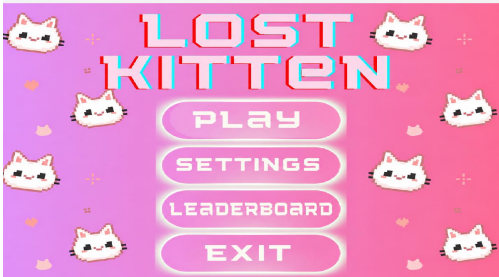
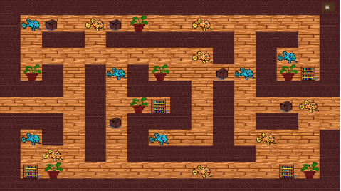
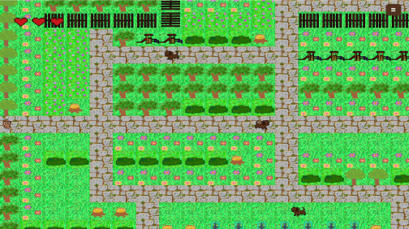
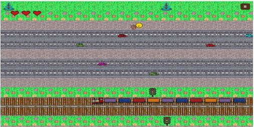
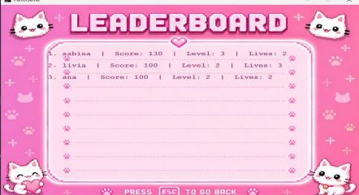

#  Lost Kitten

A 2D tile-based adventure game developed in Java using Object-Oriented Programming, Design Patterns, SQLite persistence, custom game engine components, and event-driven architecture.

The player controls **Mitzi**, a curious kitten who gets lost while exploring the city and must overcome obstacles, avoid enemies, and navigate through multiple levels to find her way home.

---

#  Gameplay Overview

Lost Kitten is a single-player adventure game consisting of three unique levels, each introducing new mechanics and challenges.

###  Level 1 – Maze Escape

* Explore a maze filled with obstacles.
* Collect fish to earn points.
* Reach the required score before the timer expires.
* Navigate using a dynamic **Fog of War** system that limits visibility.

###  Level 2 – Dog Park

* Avoid enemy dogs patrolling the map.
* Hide inside bushes to escape detection.
* Distract enemies using a ball.
* Reach the exit without losing all lives.

###  Level 3 – City Crossing

* Cross roads filled with moving vehicles.
* Avoid trains on railway tracks.
* Use checkpoints that automatically save progress.
* Reach home safely to complete the game.

---

#  Features

* Tile-based game engine
* Multi-level gameplay
* Character animations
* Enemy patrol and detection system
* Fog of War mechanic
* Collision detection system
* Event-driven architecture
* Save / Load functionality
* SQLite database integration
* Leaderboard system
* Audio management
* Custom game menus and UI
* Custom exception handling

---

#  Software Architecture

The project follows Object-Oriented Programming principles and a modular architecture.

Main subsystems include:

* Game Loop
* Entity Management System
* Tile Rendering Engine
* Camera System
* Collision System
* Event Management System
* Database Layer
* Audio System
* User Interface System

---

#  Design Patterns

## Singleton

Used by the AudioPlayer class to ensure a single audio manager instance throughout the entire game.

## Factory Method

Used for creating enemies and NPCs dynamically while keeping object creation independent from gameplay logic.

## Observer

Used for event management such as:

* Damage events
* Score updates
* Life management
* Collision notifications

## Flyweight

Used to efficiently reuse tiles and graphical assets, reducing memory consumption and improving performance.

---

#  Enemy Behaviour System

Enemy dogs implement behavior logic that includes:

* Patrol routes
* Player detection through visibility range
* Timed detection mechanics
* Reaction to player-generated distractions

This system creates dynamic gameplay while encouraging strategic movement and planning.

---

# 🌫 Fog of War

The first level implements a Fog of War system that restricts player visibility.

Only a circular area around the player remains visible while the rest of the map is hidden, encouraging exploration and increasing difficulty.

---

#  Database System

The game uses SQLite through JDBC for persistent storage.

Stored information includes:

* Player name
* Current level
* Score
* Remaining lives
* Collected items
* Checkpoint coordinates
* User settings

Database functionality:

* Save game
* Load game
* Automatic progress detection
* Checkpoint restoration
* Persistent settings
* Top 10 Leaderboard

---

#  Graphics & Assets

All pixel-art assets were created using:

* GraphicsGale
* Piskel

The project includes:

* Custom player sprites
* Enemy sprites
* Tile sets
* Environmental objects
* UI assets
* Menus and game screens

---

# ⚙ Technologies Used

* Java
* SQLite
* JDBC
* Object-Oriented Programming (OOP)
* Design Patterns
* Git & GitHub
* IntelliJ IDEA

---

# Controls

| Key   | Action                  |
| ----- | ----------------------- |
| W / ↑ | Move Up                 |
| S / ↓ | Move Down               |
| A / ← | Move Left               |
| D / → | Move Right              |
| ENTER | Hide / Exit Bush        |
| E     | Throw Ball              |
| ESC   | Return from Leaderboard |

---

#  Screenshots

## Main Menu

## Maze Level

## Dog Park

## City Crossing

## Leaderboard

---

#  UML Diagram

---

#  Future Improvements

* Additional enemy types
* More advanced enemy behaviors
* Additional levels and quests
* Achievement system
* Multiple save slots
* Improved visual effects
* Expanded leaderboard functionality

---

#  Academic Context

Developed as part of the Object-Oriented Programming course at Gheorghe Asachi Technical University of Iași.

The project demonstrates practical applications of:

* Object-Oriented Design
* Software Architecture
* Design Patterns
* Event-Driven Programming
* Database Integration
* Game Development Concepts

---

